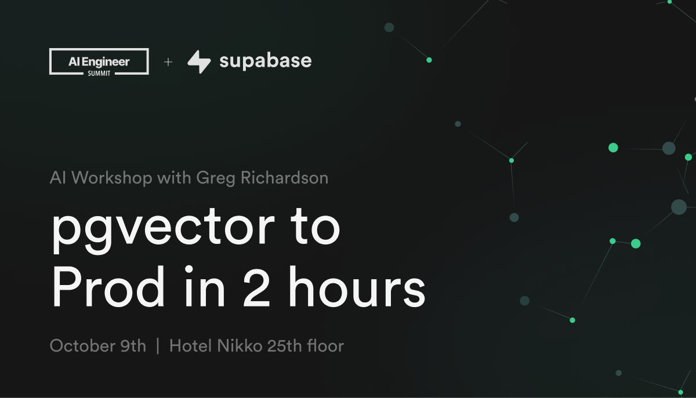
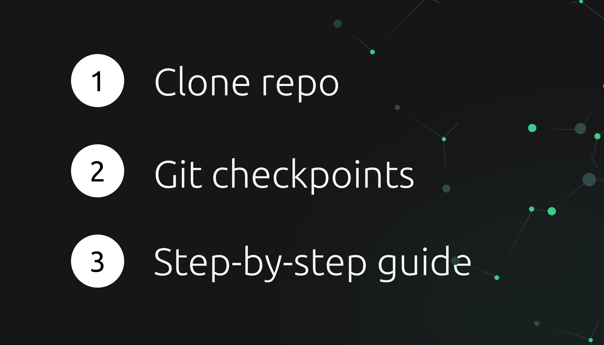
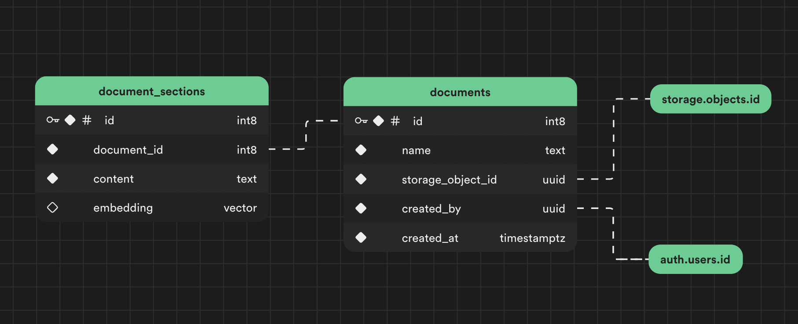

<h1 align="center">Workshop: pgvector to Prod in 2 hours</h1>

<p align="center">
Create a production-ready MVP for securely chatting with your documents.
</p>

## ☑️ Features

- **Interactive Chat Interface:** Interact with your documentation, leveraging the capabilities of OpenAI’s GPT models and retrieval augmented generation (RAG).
- **Login With <3rd Party>:** Integrate one-click 3rd party login with any of our 18 auth providers and user/password.
- **Document Storage:** Securely upload, store, and retrieve user uploaded documents.
- **REST API:** Expose a flexible REST API that we’ll consume to build the interactive front-end.
- **Row-level Security:** Secure all of your user data user data with production-ready row-level security.

## 🎥 YouTube video

This entire workshop was recorded as a YouTube video. Feel free to watch it here:

https://www.youtube.com/watch?v=ibzlEQmgPPY

## 📄 Workshop Instructions

Thanks for joining! Let's dive in.



1. **Clone repo:** Clone this repo at tag `step-1`:

   ```shell
   git clone -b step-1 https://github.com/supabase-community/chatgpt-your-files.git
   ```

   This will automatically clone at [step 1](#step-1---storage), our starting point.

1. **Git checkpoints:** The workshop is broken down into steps (git tags). There's a step for every major feature we are building.

   Feel free to follow along live with the presenter. When it's time to jump to the next step, run:

   ```shell
   git stash push -u # stash your working directory
   git checkout step-X # jump to a checkpoint (replace X wit step #)
   ```

1. **Step-by-step guide:** These steps are written out line-by-line. Feel free to follow along using the [steps below](#step-by-step).

## 🧱 Pre-req’s

- Unix-based OS (if Windows, WSL2)
- Docker
- Node.js 18+

## 💿 Sample Data

This repository includes 3 sample markdown files that we'll use to test the app:

[`./sample-files/roman-empire-1.md`](./sample-files/roman-empire-1.md)

[`./sample-files/roman-empire-2.md`](./sample-files/roman-empire-2.md)

[`./sample-files/roman-empire-3.md`](./sample-files/roman-empire-3.md)

## 🪜 Step-by-step

Jump to a step:

1. [Storage](#step-1---storage)
2. [Documents](#step-2---documents)
3. [Embeddings](#step-3---embeddings)
4. [Chat](#step-4---chat)
5. [Database Types](#step-5---database-types-bonus) (Bonus)
6. [You're done!](#youre-done)

---

<details>

<summary><strong>Step 0 - Setup</strong> <em>(Optional)</em></summary>

### `Step 0` - Setup

_Use this command to jump to the `step-0` checkpoint._

```shell
git checkout step-0
```

The beginning of step 0 is aka to:

```shell
npx create-next-app -e with-supabase
```

Refer to this step if you want to learn about the additions added on top of `create-next-app` to get us up and running quicker for this workshop _(VS Code settings, UI components/styles/layouts)_. Otherwise, skip straight to [`step-1`](#step-1---storage).

1. Install Supabase as dev dependency.

   ```bash
   npm i -D supabase@1.102.0
   ```

1. Initialize Supabase project.

   ```bash
   npx supabase init
   ```

1. (Optional) Setup VSCode environment.

   ```bash
   mkdir -p .vscode && cat > .vscode/settings.json <<- EOF
   {
     "deno.enable": true,
     "deno.lint": true,
     "deno.unstable": false,
     "deno.enablePaths": [
       "supabase"
     ],
     "deno.importMap": "./supabase/functions/import_map.json"
   }
   EOF
   ```

1. (Optional) Setup VSCode recommended extensions.

   ```bash
   cat > .vscode/extensions.json <<- EOF
   {
    "recommendations": [
      "denoland.vscode-deno",
      "esbenp.prettier-vscode",
      "dbaeumer.vscode-eslint",
      "bradlc.vscode-tailwindcss",
    ],
   }
   EOF
   ```

   Then `cmd`+`shift`+`p` → `>show recommended extensions` → install all _(or whichever you like)_

1. Create `import_map.json` with dependencies for our Supabase Edge Functions. We'll talk more about this in [step 2](#step-2---documents).

   ```bash
   cat > supabase/functions/import_map.json <<- EOF
    {
      "imports": {
        "@std/": "https://deno.land/std@0.168.0/",

        "@supabase/supabase-js": "https://esm.sh/@supabase/supabase-js@2.21.0",
        "openai": "https://esm.sh/openai@4.10.0",
        "common-tags": "https://esm.sh/common-tags@1.8.2",
        "ai": "https://esm.sh/ai@2.2.13",

        "mdast-util-from-markdown": "https://esm.sh/mdast-util-from-markdown@2.0.0",
        "mdast-util-to-markdown": "https://esm.sh/mdast-util-to-markdown@2.1.0",
        "mdast-util-to-string": "https://esm.sh/mdast-util-to-string@4.0.0",
        "unist-builder": "https://esm.sh/unist-builder@4.0.0",
        "mdast": "https://esm.sh/v132/@types/mdast@4.0.0/index.d.ts",

        "https://esm.sh/v132/decode-named-character-reference@1.0.2/esnext/decode-named-character-reference.mjs": "https://esm.sh/decode-named-character-reference@1.0.2?target=deno"
      }
    }
    EOF
   ```

#### Scaffold Frontend

We use [`shadcn/ui`](https://ui.shadcn.com/docs) for our UI components.

1. Initialize `shadcn-ui`.

   ```bash
   npx shadcn-ui@latest init
   ```

   ```bash
   Would you like to use TypeScript (recommended)? yes
   Which style would you like to use? › Default
   Which color would you like to use as base color? › Slate
   Where is your global CSS file? › › app/globals.css
   Do you want to use CSS variables for colors? › yes
   Where is your tailwind.config.js located? › tailwind.config.js
   Configure the import alias for components: › @/components
   Configure the import alias for utils: › @/lib/utils
   Are you using React Server Components? › yes
   ```

1. Add components.

   ```bash
   npx shadcn-ui@latest add button input toast
   ```

1. Install dependencies.

   ```bash
   npm i @tanstack/react-query three-dots
   ```

1. Wrap the app in a `<QueryClientProvider>`.
1. Build layouts.

</details>

---

### `Step 1` - Storage

_Use this command to jump to the `step-1` checkpoint._

```shell
git checkout step-1
```

We'll start by handling file uploads. Supabase has a built-in object storage (backed by S3 under the hood) that integrates directly with your Postgres database.

#### Install dependencies

First install NPM dependencies.

```bash
npm i
```

#### Setup Supabase stack

When developing a project in Supabase, you can choose to develop locally or directly on the cloud.

##### Local

1. Start a local version of Supabase _(runs in Docker)_.

   ```shell
   npx supabase start
   ```

1. Store the Supabase URL & public anon key in `.env.local` for Next.js.

   ```bash
   npx supabase status -o env \
     --override-name api.url=NEXT_PUBLIC_SUPABASE_URL \
     --override-name auth.anon_key=NEXT_PUBLIC_SUPABASE_ANON_KEY |
       grep NEXT_PUBLIC > .env.local
   ```

##### Cloud

1. Create a Supabase project at https://database.new, or via the CLI:

   ```shell
   npx supabase projects create -i "ChatGPT Your Files"
   ```

   Your Org ID can be found in the URL after [selecting an org](https://supabase.com/dashboard/org/_/general).

1. Link your CLI to the project.

   ```shell
   npx supabase link --project-ref=<project-id>
   ```

   You can get the project ID from the [general settings page](https://supabase.com/dashboard/project/_/settings/general).

1. Store Supabase URL & public anon key in `.env.local` for Next.js.

   ```shell
   NEXT_PUBLIC_SUPABASE_URL=<api-url>
   NEXT_PUBLIC_SUPABASE_ANON_KEY=<anon-key>
   ```

   You can get the project API URL and anonymous key from the [API settings page](https://supabase.com/dashboard/project/_/settings/api).

#### Build a SQL migration

1.  Create migration file.

    ```bash
    npx supabase migration new files
    ```

    A new file will be created under `./supabase/migrations`.

1.  Within that file, create a private schema.

    ```sql
    create schema private;
    ```

1.  Add bucket called 'files' via the `buckets` table in the `storage` schema.

    ```sql
    insert into storage.buckets (id, name)
    values ('files', 'files')
    on conflict do nothing;
    ```

1.  Add RLS policies to restrict access to files.

    ```sql
    create policy "Authenticated users can upload files"
    on storage.objects for insert to authenticated with check (
      bucket_id = 'files' and owner = auth.uid()
    );

    create policy "Users can view their own files"
    on storage.objects for select to authenticated using (
      bucket_id = 'files' and owner = auth.uid()
    );

    create policy "Users can update their own files"
    on storage.objects for update to authenticated with check (
      bucket_id = 'files' and owner = auth.uid()
    );

    create policy "Users can delete their own files"
    on storage.objects for delete to authenticated using (
      bucket_id = 'files' and owner = auth.uid()
    );
    ```

#### Modify frontend

Next let's update `./app/files/page.tsx` to support file upload.

1.  Setup Supabase client at the top of the component.

    ```tsx
    const supabase = createClientComponentClient();
    ```

1.  Handle file upload in the `<Input>`'s `onChange` prop.

    ```tsx
    await supabase.storage
      .from('files')
      .upload(`${crypto.randomUUID()}/${selectedFile.name}`, selectedFile);
    ```

#### Improve upload RLS policy

We can improve our previous RLS policy to require a UUID in the uploaded file path.

1.  Create `uuid_or_null()` function.

    ```sql
    create or replace function private.uuid_or_null(str text)
    returns uuid
    language plpgsql
    as $$
    begin
      return str::uuid;
      exception when invalid_text_representation then
        return null;
      end;
    $$;
    ```

1.  Modify insert policy to check for UUID in the first path segment _(Postgres arrays are 1-based)_.

    ```sql
    create policy "Authenticated users can upload files"
    on storage.objects for insert to authenticated with check (
      bucket_id = 'files' and
        owner = auth.uid() and
        private.uuid_or_null(path_tokens[1]) is not null
    );
    ```

1.  Apply the migration to our local database.

    ```bash
    npx supabase migration up
    ```

    or if you are developing directly on the cloud, push your migrations up:

    ```
    npx supabase db push
    ```

---

### `Step 2` - Documents

Jump to a step:

1. [Storage](#step-1---storage)
2. [Documents](#step-2---documents)
3. [Embeddings](#step-3---embeddings)
4. [Chat](#step-4---chat)
5. [Database Types](#step-5---database-types-bonus) (Bonus)
6. [You're done!](#youre-done)

---

_Use these commands to jump to the `step-2` checkpoint._

```shell
git stash push -u -m "my work on step-1"
git checkout step-2
```

Next we'll need to process our files for retrieval augmented generation (RAG). Specifically we'll split the contents of our markdown documents by heading, which will allow us to query smaller and more meaningful sections.

Let's create a `documents` and `document_sections` table to store our processed files.



#### Add a new SQL migration

1.  Create migration file.

    ```bash
    npx supabase migration new documents
    ```

1.  Enable `pgvector` and `pg_net` extensions.

    We'll use `pg_net` later to send HTTP requests to our edge functions.

    ```sql
    create extension if not exists pg_net with schema extensions;
    create extension if not exists vector with schema extensions;
    ```

1.  Create `documents` table.

    ```sql
    create table documents (
      id bigint primary key generated always as identity,
      name text not null,
      storage_object_id uuid not null references storage.objects (id),
      created_by uuid not null references auth.users (id) default auth.uid(),
      created_at timestamp with time zone not null default now()
    );
    ```

1.  We'll also create a view `documents_with_storage_path` that provides easy access to the storage object path.

    ```sql
    create view documents_with_storage_path
    with (security_invoker=true)
    as
      select documents.*, storage.objects.name as storage_object_path
      from documents
      join storage.objects
        on storage.objects.id = documents.storage_object_id;
    ```

1.  Create `document_sections` table.

    ```sql
    create table document_sections (
      id bigint primary key generated always as identity,
      document_id bigint not null references documents (id),
      content text not null,
      embedding vector (384)
    );
    ```

    _Note: Since the video was published, `on delete cascade` was
    added as a new migration so that the lifecycle of `document_sections`
    is tied to their respective document._

    ```sql
    alter table document_sections
    drop constraint document_sections_document_id_fkey,
    add constraint document_sections_document_id_fkey
      foreign key (document_id)
      references documents(id)
      on delete cascade;
    ```

1.  Add HNSW index.

    Unlike IVFFlat indexes, HNSW indexes can be create immediately on an empty table.

    ```sql
    create index on document_sections using hnsw (embedding vector_ip_ops);
    ```

1.  Setup RLS to control who has access to which documents.

    ```sql
    alter table documents enable row level security;
    alter table document_sections enable row level security;

    create policy "Users can insert documents"
    on documents for insert to authenticated with check (
      auth.uid() = created_by
    );

    create policy "Users can query their own documents"
    on documents for select to authenticated using (
      auth.uid() = created_by
    );

    create policy "Users can insert document sections"
    on document_sections for insert to authenticated with check (
      document_id in (
        select id
        from documents
        where created_by = auth.uid()
      )
    );

    create policy "Users can update their own document sections"
    on document_sections for update to authenticated using (
      document_id in (
        select id
        from documents
        where created_by = auth.uid()
      )
    ) with check (
      document_id in (
        select id
        from documents
        where created_by = auth.uid()
      )
    );

    create policy "Users can query their own document sections"
    on document_sections for select to authenticated using (
      document_id in (
        select id
        from documents
        where created_by = auth.uid()
      )
    );
    ```

1.  If developing locally, add `supabase_url` secret to `./supabase/seed.sql`. We will use this to query our Edge Functions within our local environment.

    ```sql
    select vault.create_secret(
      'http://api.supabase.internal:8000',
      'supabase_url'
    );
    ```

    If you are developing directly on the cloud, open up the [SQL Editor](https://supabase.com/dashboard/project/_/sql/new) and set this to your Supabase project's API URL:

    ```sql
    select vault.create_secret(
      '<api-url>',
      'supabase_url'
    );
    ```

    You can get the project API URL from the [API settings page](https://supabase.com/dashboard/project/_/settings/api).

1.  Create a function to retrieve the URL.

    ```sql
    create function supabase_url()
    returns text
    language plpgsql
    security definer
    as $$
    declare
      secret_value text;
    begin
      select decrypted_secret into secret_value from vault.decrypted_secrets where name = 'supabase_url';
      return secret_value;
    end;
    $$;
    ```

1.  Create a trigger to process new documents when they're inserted. This uses `pg_net` to send an HTTP request to our Edge Function (coming up next).

    ```sql
    create function private.handle_storage_update()
    returns trigger
    language plpgsql
    as $$
    declare
      document_id bigint;
      result int;
    begin
      insert into documents (name, storage_object_id, created_by)
        values (new.path_tokens[2], new.id, new.owner)
        returning id into document_id;

      select
        net.http_post(
          url := supabase_url() || '/functions/v1/process',
          headers := jsonb_build_object(
            'Content-Type', 'application/json',
            'Authorization', current_setting('request.headers')::json->>'authorization'
          ),
          body := jsonb_build_object(
            'document_id', document_id
          )
        )
      into result;

      return null;
    end;
    $$;

    create trigger on_file_upload
      after insert on storage.objects
      for each row
      execute procedure private.handle_storage_update();
    ```

1.  Apply the migration to our local database.

    ```bash
    npx supabase migration up
    ```

    or if you are developing directly on the cloud, push your migrations up:

    ```
    npx supabase db push
    ```

#### Edge function for `process`

1.  Create the Edge Function file.

    ```bash
    npx supabase functions new process
    ```

    This will create the file `./supabase/functions/process/index.ts`.

    Make sure you have the latest version of `deno` installed

    ```bash
    brew install deno
    ```

1.  First let's note how dependencies are resolved using an import map - `./supabase/functions/import_map.json`.

    Import maps aren't required in Deno, but they can simplify imports and keep dependency versions consistent. All of our dependencies come from NPM, but since we're using Deno we fetch them from a CDN like https://esm.sh or https://cdn.jsdelivr.net.

    ```json
    {
      "imports": {
        "@std/": "https://deno.land/std@0.168.0/",

        "@supabase/supabase-js": "https://esm.sh/@supabase/supabase-js@2.21.0",
        "openai": "https://esm.sh/openai@4.10.0",
        "common-tags": "https://esm.sh/common-tags@1.8.2",
        "ai": "https://esm.sh/ai@2.2.13",

        "mdast-util-from-markdown": "https://esm.sh/mdast-util-from-markdown@2.0.0",
        "mdast-util-to-markdown": "https://esm.sh/mdast-util-to-markdown@2.1.0",
        "mdast-util-to-string": "https://esm.sh/mdast-util-to-string@4.0.0",
        "unist-builder": "https://esm.sh/unist-builder@4.0.0",
        "mdast": "https://esm.sh/v132/@types/mdast@4.0.0/index.d.ts",

        "https://esm.sh/v132/decode-named-character-reference@1.0.2/esnext/decode-named-character-reference.mjs": "https://esm.sh/decode-named-character-reference@1.0.2?target=deno"
      }
    }
    ```

    _Note: URL based imports and import maps aren't a Deno invention. These are a [web standard](https://developer.mozilla.org/en-US/docs/Web/HTML/Element/script/type/importmap) that Deno follows as closely as possible._

1.  In `process/index.ts`, first grab the Supabase environment variables.

    ```tsx
    import { createClient } from '@supabase/supabase-js';
    import { processMarkdown } from '../_lib/markdown-parser.ts';

    // These are automatically injected
    const supabaseUrl = Deno.env.get('SUPABASE_URL');
    const supabaseAnonKey = Deno.env.get('SUPABASE_ANON_KEY');

    Deno.serve(async (req) => {
      if (!supabaseUrl || !supabaseAnonKey) {
        return new Response(
          JSON.stringify({
            error: 'Missing environment variables.',
          }),
          {
            status: 500,
            headers: { 'Content-Type': 'application/json' },
          }
        );
      }
    });
    ```

    _Note: These environment variables are automatically injected into the edge runtime for you. Even so, we check for their existence as a TypeScript best practice (type narrowing)._

1.  _(Optional)_ If you are using VS Code, you may get prompted to cache your imported dependencies. You can do this by hitting `cmd`+`shift`+`p` and type `>Deno: Cache Dependencies`.

1.  Create Supabase client and configure it to inherit the original user’s permissions via the authorization header. This way we can continue to take advantage of our RLS policies.

    ```tsx
    const authorization = req.headers.get('Authorization');

    if (!authorization) {
      return new Response(
        JSON.stringify({ error: `No authorization header passed` }),
        {
          status: 500,
          headers: { 'Content-Type': 'application/json' },
        }
      );
    }

    const supabase = createClient(supabaseUrl, supabaseAnonKey, {
      global: {
        headers: {
          authorization,
        },
      },
      auth: {
        persistSession: false,
      },
    });
    ```

1.  Grab the `document_id` from the request body and query it.

    ```tsx
    const { document_id } = await req.json();

    const { data: document } = await supabase
      .from('documents_with_storage_path')
      .select()
      .eq('id', document_id)
      .single();

    if (!document?.storage_object_path) {
      return new Response(
        JSON.stringify({ error: 'Failed to find uploaded document' }),
        {
          status: 500,
          headers: { 'Content-Type': 'application/json' },
        }
      );
    }
    ```

1.  Use the Supabase client to download the file by storage path.

    ```tsx
    const { data: file } = await supabase.storage
      .from('files')
      .download(document.storage_object_path);

    if (!file) {
      return new Response(
        JSON.stringify({ error: 'Failed to download storage object' }),
        {
          status: 500,
          headers: { 'Content-Type': 'application/json' },
        }
      );
    }

    const fileContents = await file.text();
    ```

1.  Process the markdown file and store the resulting subsections into the `document_sections` table.

    _Note: `processMarkdown()` is pre-built into this repository for convenience. Feel free to read through its code to learn how it splits the markdown content._

    ```tsx
    const processedMd = processMarkdown(fileContents);

    const { error } = await supabase.from('document_sections').insert(
      processedMd.sections.map(({ content }) => ({
        document_id,
        content,
      }))
    );

    if (error) {
      console.error(error);
      return new Response(
        JSON.stringify({ error: 'Failed to save document sections' }),
        {
          status: 500,
          headers: { 'Content-Type': 'application/json' },
        }
      );
    }

    console.log(
      `Saved ${processedMd.sections.length} sections for file '${document.name}'`
    );
    ```

1.  Return a success response.

    ```tsx
    return new Response(null, {
      status: 204,
      headers: { 'Content-Type': 'application/json' },
    });
    ```

1.  If developing locally, open a new terminal and serve the edge functions.

    ```bash
    npx supabase functions serve
    ```

    _Note: Local Edge Functions are automatically served as part of `npx supabase start`, but this command allows us to also monitor their logs._

    If you're developing directly on the cloud, deploy your edge function:

    ```shell
    npx supabase functions deploy
    ```

#### Display documents on the frontend

Let's update `./app/files/page.tsx` to list out the uploaded documents.

1.  At the top of the component, fetch documents using the `useQuery` hook:

    ```tsx
    const { data: documents } = useQuery(['files'], async () => {
      const { data, error } = await supabase
        .from('documents_with_storage_path')
        .select();

      if (error) {
        toast({
          variant: 'destructive',
          description: 'Failed to fetch documents',
        });
        throw error;
      }

      return data;
    });
    ```

1.  In each document's `onClick` handler, download the respective file.

    ```tsx
    const { data, error } = await supabase.storage
      .from('files')
      .createSignedUrl(document.storage_object_path, 60);

    if (error) {
      toast({
        variant: 'destructive',
        description: 'Failed to download file. Please try again.',
      });
      return;
    }

    window.location.href = data.signedUrl;
    ```

---

### `Step 3` - Embeddings

Jump to a step:

1. [Storage](#step-1---storage)
2. [Documents](#step-2---documents)
3. [Embeddings](#step-3---embeddings)
4. [Chat](#step-4---chat)
5. [Database Types](#step-5---database-types-bonus) (Bonus)
6. [You're done!](#youre-done)

---

_Use these commands to jump to the `step-3` checkpoint._

```shell
git stash push -u -m "my work on step-2"
git checkout step-3
```

Now let's add logic to generate embeddings automatically anytime new rows are added to the `document_sections` table.

#### Create SQL migration

1.  Create migration file

    ```bash
    npx supabase migration new embed
    ```

1.  Create `embed()` trigger function. We'll use this general purpose trigger function to asynchronously generate embeddings on arbitrary tables using a new `embed` Edge Function (coming up).

    ```sql
    create function private.embed()
    returns trigger
    language plpgsql
    as $$
    declare
      content_column text = TG_ARGV[0];
      embedding_column text = TG_ARGV[1];
      batch_size int = case when array_length(TG_ARGV, 1) >= 3 then TG_ARGV[2]::int else 5 end;
      timeout_milliseconds int = case when array_length(TG_ARGV, 1) >= 4 then TG_ARGV[3]::int else 5 * 60 * 1000 end;
      batch_count int = ceiling((select count(*) from inserted) / batch_size::float);
    begin
      -- Loop through each batch and invoke an edge function to handle the embedding generation
      for i in 0 .. (batch_count-1) loop
      perform
        net.http_post(
          url := supabase_url() || '/functions/v1/embed',
          headers := jsonb_build_object(
            'Content-Type', 'application/json',
            'Authorization', current_setting('request.headers')::json->>'authorization'
          ),
          body := jsonb_build_object(
            'ids', (select json_agg(ds.id) from (select id from inserted limit batch_size offset i*batch_size) ds),
            'table', TG_TABLE_NAME,
            'contentColumn', content_column,
            'embeddingColumn', embedding_column
          ),
          timeout_milliseconds := timeout_milliseconds
        );
      end loop;

      return null;
    end;
    $$;
    ```

1.  Add embed trigger to `document_sections` table

    ```sql
    create trigger embed_document_sections
      after insert on document_sections
      referencing new table as inserted
      for each statement
      execute procedure private.embed(content, embedding);
    ```

    Note we pass 2 trigger arguments to `embed()`:

    - The first specifies which column contains the text content to embed.
    - The second specifies the destination column to save the embedding into.

    There are also 2 more optional trigger arguments available:

    ```sql
    create trigger embed_document_sections
      after insert on document_sections
      referencing new table as inserted
      for each statement
      execute procedure private.embed(content, embedding, 5, 300000);
    ```

    - The third argument specifies the batch size (number of records to include in each edge function call). Default is 5.
    - The fourth argument specifies the HTTP connection timeout for each edge function call. Default is 300000 ms (5 minutes).

    Feel free to adjust these according to your needs. A larger batch size will require a longer timeout per request, since each invocation will have more embeddings to generate. A smaller batch size can use a lower timeout.

    <details>
    <summary><i>Note: Lifecycle of triggered edge functions</i></summary>
    If the triggered edge function fails, you will end up with
    document sections missing embeddings. During development,
    we can run `supabase db reset` to reset the database. In production,
    some potential options are:

    - Add another function that can be triggered manually which checks for `document_sections` with missing embeddings and invokes the `/embed` edge function for them.
    - Create a [scheduled function](https://supabase.com/docs/guides/functions/schedule-functions) that periodically checks for `document_sections` with missing embeddings and re-generates them. We would likely need to add a locking mechanism (ie. via another column) to prevent the scheduled function from conflicting with the normal `embed` trigger.
    </details>

1.  Apply the migration to our local database.

    ```bash
    npx supabase migration up
    ```

    or if you are developing directly on the cloud, push your migrations up:

    ```
    npx supabase db push
    ```

#### Create Edge Function for `embed`

1.  Create edge function file.

    ```bash
    npx supabase functions new embed
    ```

1.  In `embed/index.ts`, create an inference session using Supabase's AI inference engine.

    ```tsx
    // Setup type definitions for built-in Supabase Runtime APIs
    /// <reference types="https://esm.sh/@supabase/functions-js/src/edge-runtime.d.ts" />

    import { createClient } from '@supabase/supabase-js';

    const model = new Supabase.ai.Session('gte-small');
    ```

    _Note: The original code from the video tutorial used Transformers.js to perform inference in the Edge Function. We've since released [Supabase.ai APIs](https://supabase.com/docs/guides/functions/ai-models) that can perform inference natively within the runtime itself (vs. WASM) which is faster and uses less CPU time._

1.  Just like before, grab the Supabase variables and check for their existence _(type narrowing)_.

    ```tsx
    // These are automatically injected
    const supabaseUrl = Deno.env.get('SUPABASE_URL');
    const supabaseAnonKey = Deno.env.get('SUPABASE_ANON_KEY');

    Deno.serve(async (req) => {
      if (!supabaseUrl || !supabaseAnonKey) {
        return new Response(
          JSON.stringify({
            error: 'Missing environment variables.',
          }),
          {
            status: 500,
            headers: { 'Content-Type': 'application/json' },
          }
        );
      }
    });
    ```

1.  Create a Supabase client and configure to inherit the user’s permissions.

    ```tsx
    const authorization = req.headers.get('Authorization');

    if (!authorization) {
      return new Response(
        JSON.stringify({ error: `No authorization header passed` }),
        {
          status: 500,
          headers: { 'Content-Type': 'application/json' },
        }
      );
    }

    const supabase = createClient(supabaseUrl, supabaseAnonKey, {
      global: {
        headers: {
          authorization,
        },
      },
      auth: {
        persistSession: false,
      },
    });
    ```

1.  Fetch the text content from the specified table/column.

    ```tsx
    const { ids, table, contentColumn, embeddingColumn } = await req.json();

    const { data: rows, error: selectError } = await supabase
      .from(table)
      .select(`id, ${contentColumn}` as '*')
      .in('id', ids)
      .is(embeddingColumn, null);

    if (selectError) {
      return new Response(JSON.stringify({ error: selectError }), {
        status: 500,
        headers: { 'Content-Type': 'application/json' },
      });
    }
    ```

1.  Generate an embedding for each piece of text and update the respective rows.

    ```ts
    for (const row of rows) {
      const { id, [contentColumn]: content } = row;

      if (!content) {
        console.error(`No content available in column '${contentColumn}'`);
        continue;
      }

      const output = (await model.run(content, {
        mean_pool: true,
        normalize: true,
      })) as number[];

      const embedding = JSON.stringify(output);

      const { error } = await supabase
        .from(table)
        .update({
          [embeddingColumn]: embedding,
        })
        .eq('id', id);

      if (error) {
        console.error(
          `Failed to save embedding on '${table}' table with id ${id}`
        );
      }

      console.log(
        `Generated embedding ${JSON.stringify({
          table,
          id,
          contentColumn,
          embeddingColumn,
        })}`
      );
    }
    ```

1.  Return a success response.

    ```tsx
    return new Response(null, {
      status: 204,
      headers: { 'Content-Type': 'application/json' },
    });
    ```

1.  If you're developing directly on the cloud, deploy your edge function:

    ```shell
    npx supabase functions deploy
    ```

---

### `Step 4` - Chat

Jump to a step:

1. [Storage](#step-1---storage)
2. [Documents](#step-2---documents)
3. [Embeddings](#step-3---embeddings)
4. [Chat](#step-4---chat)
5. [Database Types](#step-5---database-types-bonus) (Bonus)
6. [You're done!](#youre-done)

---

_Use these commands to jump to the `step-4` checkpoint._

```shell
git stash push -u -m "my work on step-3"
git checkout step-4
```

Finally, let's implement the chat functionality. For this workshop, we're going to generate our query embedding client side using a new custom hook called `usePipeline()`.

#### Update Frontend

1.  Install dependencies

    ```bash
    npm i @xenova/transformers ai
    ```

    We'll use [Transformers.js](https://github.com/xenova/transformers.js) to perform inference directly in the browser.

1.  Configure `next.config.js` to support Transformers.js

    ```jsx
      webpack: (config) => {
        config.resolve.alias = {
          ...config.resolve.alias,
          sharp$: false,
          'onnxruntime-node$': false,
        };
        return config;
      },
    ```

1.  Import dependencies

    ```tsx
    import { usePipeline } from '@/lib/hooks/use-pipeline';
    import { createClientComponentClient } from '@supabase/auth-helpers-nextjs';
    import { useChat } from 'ai/react';
    ```

    _Note: `usePipeline()` was pre-built into this repository for convenience. It uses Web Workers to asynchronously generate embeddings in another thread using Transformers.js._

1.  Create a Supabase client in `chat/page.tsx`.

    ```tsx
    const supabase = createClientComponentClient();
    ```

1.  Create embedding pipeline.

    ```tsx
    const generateEmbedding = usePipeline(
      'feature-extraction',
      'Supabase/gte-small'
    );
    ```

    _Note: it's important that the embedding model you set here matches the model used in the Edge Function, otherwise your future matching logic will be meaningless._

    _Transformers.js requires models to exist in the ONNX format. Specifically
    the Hugging Face model you specify in the pipeline must have an `.onnx` file
    under the `./onnx` folder, otherwise you will see the error
    `Could not locate file [...] xxx.onnx`. Check out
    [this explanation](https://www.youtube.com/watch?v=QdDoFfkVkcw&t=3825s) for more details.
    To convert an existing model (eg. PyTorch, Tensorflow, etc) to ONNX, see
    the [custom usage documentation](https://huggingface.co/docs/transformers.js/en/custom_usage#convert-your-models-to-onnx)._

1.  Manage chat messages and state with `useChat()`.

    ```tsx
    const { messages, input, handleInputChange, handleSubmit, isLoading } =
      useChat({
        api: `${process.env.NEXT_PUBLIC_SUPABASE_URL}/functions/v1/chat`,
      });
    ```

    _Note: `useChat()` is a convenience hook provided by Vercel's `ai` package to handle chat message state and streaming. We'll point it to an Edge Function called `chat` (coming up)._

1.  Set the ready status to `true` when pipeline has loaded.

    ```tsx
    const isReady = !!generateEmbedding;
    ```

1.  Connect `input` and `handleInputChange` to our `<Input>` props.

    ```tsx
    <Input
      type="text"
      autoFocus
      placeholder="Send a message"
      value={input}
      onChange={handleInputChange}
    />
    ```

1.  Generate an embedding and submit messages on form submit.

    ```tsx
    if (!generateEmbedding) {
      throw new Error('Unable to generate embeddings');
    }

    const output = await generateEmbedding(input, {
      pooling: 'mean',
      normalize: true,
    });

    const embedding = JSON.stringify(Array.from(output.data));

    const {
      data: { session },
    } = await supabase.auth.getSession();

    if (!session) {
      return;
    }

    handleSubmit(e, {
      options: {
        headers: {
          authorization: `Bearer ${session.access_token}`,
        },
        body: {
          embedding,
        },
      },
    });
    ```

1.  Disable send button until the component is ready.

    ```tsx
    <Button type="submit" disabled={!isReady}>
      Send
    </Button>
    ```

#### SQL Migration

1.  Create migration file for a new match function

    ```bash
    npx supabase migration new match
    ```

1.  Create a `match_document_sections` Postgres function.

    ```sql
    create or replace function match_document_sections(
      embedding vector(384),
      match_threshold float
    )
    returns setof document_sections
    language plpgsql
    as $$
    #variable_conflict use_variable
    begin
      return query
      select *
      from document_sections
      where document_sections.embedding <#> embedding < -match_threshold
    	order by document_sections.embedding <#> embedding;
    end;
    $$;
    ```

    This function uses pgvector's negative inner product operator `<#>` to perform similarity search. Inner product requires less computations than other distance functions like cosine distance `<=>`, and therefore provides better query performance.

    _Note: Our embeddings are normalized, so inner product and cosine similarity are equivalent in terms of output. Note though that pgvector's `<=>` operator is cosine distance, not cosine similarity, so `inner product == 1 - cosine distance`._

    We also filter by a `match_threshold` in order to return only the most relevant results (1 = most similar, -1 = most dissimilar).

    _Note: `match_threshold` is negated because `<#>` is a negative inner product. See the pgvector docs for more details on why `<#>` is negative._

1.  Apply the migration to our local database.

    ```bash
    npx supabase migration up
    ```

    or if you are developing directly on the cloud, push your migrations up:

    ```
    npx supabase db push
    ```

#### Create `chat` Edge Function

**Note:** In this tutorial we use models provided by OpenAI to implement the chat logic.
However since making this tutorial, many new LLM providers exist, such as:

- [together.ai](https://docs.together.ai/docs/openai-api-compatibility#nodejs)
- [fireworks.ai](https://readme.fireworks.ai/docs/openai-compatibility)
- [endpoints.anyscale.com](https://docs.endpoints.anyscale.com/examples/work-with-openai/)
- [local models served with Ollama](https://github.com/ollama/ollama/blob/main/docs/openai.md#openai-javascript-library)

Whichever provider you choose, you can reuse the code below (that uses the OpenAI lib) as long as they offer an OpenAI-compatible API _(all of providers listed above do)_. We'll discuss how to do this in each step using Ollama, but the same logic applies to the other providers.

1.  First generate an API key from [OpenAI](https://platform.openai.com/account/api-keys) and save it in `supabase/functions/.env`.

    ```bash
    cat > supabase/functions/.env <<- EOF
    OPENAI_API_KEY=<your-api-key>
    EOF
    ```

1.  Create the edge function file.

    ```bash
    npx supabase functions new chat
    ```

1.  Load the OpenAI and Supabase keys.

    ```tsx
    import { createClient } from '@supabase/supabase-js';
    import { OpenAIStream, StreamingTextResponse } from 'ai';
    import { codeBlock } from 'common-tags';
    import OpenAI from 'openai';

    const openai = new OpenAI({
      apiKey: Deno.env.get('OPENAI_API_KEY'),
    });

    // These are automatically injected
    const supabaseUrl = Deno.env.get('SUPABASE_URL');
    const supabaseAnonKey = Deno.env.get('SUPABASE_ANON_KEY');
    ```

    <details>
    <summary><i>Note: Ollama support</i></summary>

    For Ollama (and other OpenAI-compatible providers), adjust the `baseURL` and `apiKey` when instantiating `openai`:

    ```tsx
    const openai = new OpenAI({
      baseURL: 'http://host.docker.internal:11434/v1/',
      apiKey: 'ollama',
    });
    ```

    We assume here that you're running `ollama serve` locally
    with the default port `:11434`.
    Since local edge functions run inside a Docker container,
    we specify `host.docker.internal` instead of `localhost`
    in order to reach Ollama running on your host.

    </details>

1.  Since our frontend is served at a different domain origin than our Edge Function, we must handle cross origin resource sharing (CORS).

    ```tsx
    export const corsHeaders = {
      'Access-Control-Allow-Origin': '*',
      'Access-Control-Allow-Headers':
        'authorization, x-client-info, apikey, content-type',
    };

    Deno.serve(async (req) => {
      // Handle CORS
      if (req.method === 'OPTIONS') {
        return new Response('ok', { headers: corsHeaders });
      }
    });
    ```

    Handle CORS simply by checking for an `OPTIONS` HTTP request and returning the CORS headers (`*` = allow any domain). In production, consider limiting the origins to specific domains that serve your frontend.

1.  Check for environment variables and create Supabase client.

    ```tsx
    if (!supabaseUrl || !supabaseAnonKey) {
      return new Response(
        JSON.stringify({
          error: 'Missing environment variables.',
        }),
        {
          status: 500,
          headers: { 'Content-Type': 'application/json' },
        }
      );
    }

    const authorization = req.headers.get('Authorization');

    if (!authorization) {
      return new Response(
        JSON.stringify({ error: `No authorization header passed` }),
        {
          status: 500,
          headers: { 'Content-Type': 'application/json' },
        }
      );
    }

    const supabase = createClient(supabaseUrl, supabaseAnonKey, {
      global: {
        headers: {
          authorization,
        },
      },
      auth: {
        persistSession: false,
      },
    });
    ```

1.  The first step of RAG is to perform similarity search using our `match_document_sections()` function. Postgres functions are executed using the `.rpc()` method.

    ```tsx
    const { chatId, message, messages, embedding } = await req.json();

    const { data: documents, error: matchError } = await supabase
      .rpc('match_document_sections', {
        embedding,
        match_threshold: 0.8,
      })
      .select('content')
      .limit(5);

    if (matchError) {
      console.error(matchError);

      return new Response(
        JSON.stringify({
          error: 'There was an error reading your documents, please try again.',
        }),
        {
          status: 500,
          headers: { 'Content-Type': 'application/json' },
        }
      );
    }
    ```

1.  The second step of RAG is to build our prompt, injecting in the relevant documents retrieved from our previous similarity search.

    ```tsx
    const injectedDocs =
      documents && documents.length > 0
        ? documents.map(({ content }) => content).join('\n\n')
        : 'No documents found';

    const completionMessages: OpenAI.Chat.Completions.ChatCompletionMessageParam[] =
      [
        {
          role: 'user',
          content: codeBlock`
              You're an AI assistant who answers questions about documents.
    
              You're a chat bot, so keep your replies succinct.
    
              You're only allowed to use the documents below to answer the question.
    
              If the question isn't related to these documents, say:
              "Sorry, I couldn't find any information on that."
    
              If the information isn't available in the below documents, say:
              "Sorry, I couldn't find any information on that."
    
              Do not go off topic.
    
              Documents:
              ${injectedDocs}
            `,
        },
        ...messages,
      ];
    ```

    _Note: the `codeBlock` template tag is a convenience function that will strip away indentations in our multiline string. This allows us to format our code nicely while preserving the intended indentation._

1.  Finally, create a completion stream and return it.

    ```tsx
    const completionStream = await openai.chat.completions.create({
      model: 'gpt-3.5-turbo-0125',
      messages: completionMessages,
      max_tokens: 1024,
      temperature: 0,
      stream: true,
    });

    const stream = OpenAIStream(completionStream);
    return new StreamingTextResponse(stream, { headers: corsHeaders });
    ```

    `OpenAIStream` and `StreamingTextResponse` are convenience helpers from Vercel's `ai` package that translate OpenAI's response stream into a format that `useChat()` understands on the frontend.

    _Note: we must also return CORS headers here (or anywhere else we send a response)._

    <details>
    <summary><i>Note: Ollama support</i></summary>
    Change the model to a model you're serving locally, for example:

    ```diff
    -     model: 'gpt-3.5-turbo-0125',
    +     model: 'dolphin-mistral',
    ```

    </details>

1.  If you're developing directly on the cloud, set your `OPENAI_API_KEY` secret in the cloud:

    ```shell
    npx supabase secrets set OPENAI_API_KEY=<openai-key>
    ```

    Then deploy your edge function:

    ```shell
    npx supabase functions deploy
    ```

#### Try it!

Let's try it out! Here are some questions you could try asking:

- What kind of buildings did they live in?
- What was the most common food?
- What did people do for fun?

---

### `Step 5` - Database Types (Bonus)

Jump to a step:

1. [Storage](#step-1---storage)
2. [Documents](#step-2---documents)
3. [Embeddings](#step-3---embeddings)
4. [Chat](#step-4---chat)
5. [Database Types](#step-5---database-types-bonus) (Bonus)
6. [You're done!](#youre-done)

---

_Use these commands to jump to the `step-5` checkpoint._

```shell
git stash push -u -m "my work on step-4"
git checkout step-5
```

You may have noticed that all of our DB data coming back from the `supabase` client has had an `any` type (such as `documents` or `document_sections`). This isn't great, since we're missing relevant type information and lose type safety _(making our app more error-prone)_.

The Supabase CLI comes with a built-in command to generate TypeScript types based on your database's schema.

1. Generate TypeScript types based on local DB schema.

   ```bash
   supabase gen types typescript --local > supabase/functions/_lib/database.ts
   ```

1. Add the `<Database>` generic to all Supabase clients across our project.

   1. In React

      ```tsx
      import { Database } from '@/supabase/functions/_lib/database';

      const supabase = createClientComponentClient<Database>();
      ```

      ```tsx
      import { Database } from '@/supabase/functions/_lib/database';

      const supabase = createServerComponentClient<Database>();
      ```

   1. In Edge Functions

      ```tsx
      import { Database } from '../_lib/database.ts';

      const supabase = createClient<Database>(...);
      ```

1. Fix type errors 😃

   1. Looks like we found a type error in `./app/files/page.tsx`! Let's add this check to top of the document's click handler _(type narrowing)_.

      ```tsx
      if (!document.storage_object_path) {
        toast({
          variant: 'destructive',
          description: 'Failed to download file, please try again.',
        });
        return;
      }
      ```

### You're done!

🎉 Congrats! You've built your own full stack pgvector app in 2 hours.

If you would like to jump directly to the completed app, simply checkout the `main` branch:

```shell
git checkout main
```

Jump to a previous step:

1. [Storage](#step-1---storage)
2. [Documents](#step-2---documents)
3. [Embeddings](#step-3---embeddings)
4. [Chat](#step-4---chat)
5. [Database Types](#step-5---database-types-bonus) (Bonus)
6. [You're done!](#youre-done)

## 🚀 Going to prod

If you've been developing the app locally, follow these instructions to deploy your app to a production Supabase project.

1. Create a Supabase project at https://database.new, or via the CLI:

   ```shell
   npx supabase projects create -i "ChatGPT Your Files"
   ```

1. Link the CLI with your Supabase project.

   ```bash
   npx supabase link --project-ref=<project-ref>
   ```

   You can grab your project's reference ID in your [project’s settings](https://supabase.com/dashboard/project/_/settings/general).

1. Push migrations to remote database.

   ```bash
   npx supabase db push
   ```

1. Set Edge Function secrets (OpenAI key).

   ```bash
   npx supabase secrets set OPENAI_API_KEY=<openai-key>
   ```

1. Deploy Edge Functions.

   ```bash
   npx supabase functions deploy
   ```

1. Deploy to Vercel _(or CDN of your choice - must support Next.js API routes for authentication)_.

   - Follow Vercel’s [deploy instructions](https://nextjs.org/learn/basics/deploying-nextjs-app/deploy).
   - Be sure to set `NEXT_PUBLIC_SUPABASE_URL` and `NEXT_PUBLIC_SUPABASE_ANON_KEY` for your Supabase project.

     You can find these in your [project’s API settings](https://supabase.com/dashboard/project/_/settings/api).

## 📈 Next steps

Feel free to extend this app in any way you like. Here are some ideas for next steps:

- Record message history in the database (and generate embeddings on them for RAG memory)
- Support more file formats than just markdown
- Pull in documents from the Notion API
- Restrict chat to user-selected documents
- Perform RAG on images using CLIP embeddings

## 💬 Feedback and issues

Please file feedback and issues on the [on this repo's issue board](https://github.com/supabase-community/chatgpt-your-files/issues/new/choose).

## 🔗 Supabase Vector resources

- [Supabase AI & Vector](https://supabase.com/docs/guides/ai)
- [pgvector Columns](https://supabase.com/docs/guides/ai/vector-columns)
- [pgvector Indexes](https://supabase.com/docs/guides/ai/vector-indexes)
- [Generate Embeddings using Edge Functions](https://supabase.com/docs/guides/ai/quickstarts/generate-text-embeddings)
- [Going to Production](https://supabase.com/docs/guides/ai/going-to-prod)
